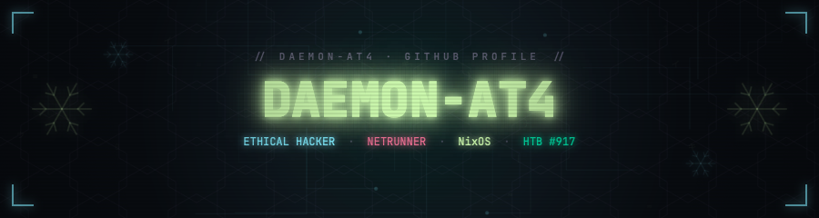
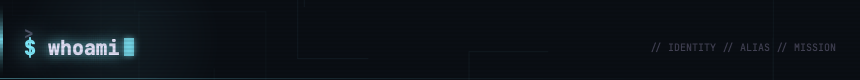
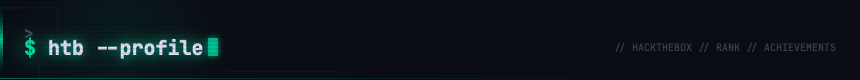
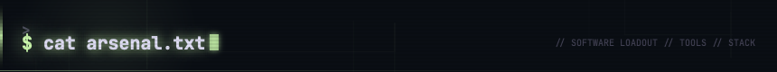
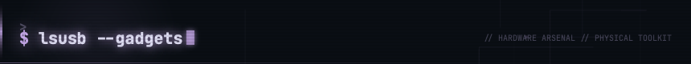
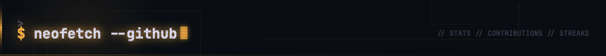
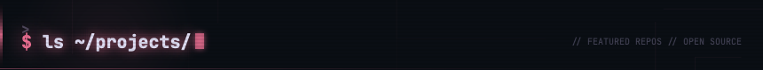
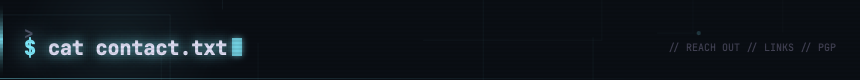
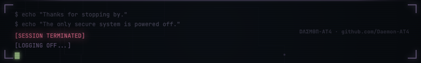

<div align="center">



<!-- ════════════════════════════════════════════════════════════════════════ -->
<!--  D Λ Σ M Ө П   //   D a e m o n - A T 4   //   p r o f i l e            -->
<!--  Rose Pine cyberpunk netrunner HUD                                       -->
<!-- ════════════════════════════════════════════════════════════════════════ -->

<a href="https://github.com/Daemon-AT4"></a>

<br/>

<!--  ░▒▓  DAEMON PALETTE  ▓▒░  phosphor · cyan · amber · pink · iris · pale   -->

<p align="center">
  
  
  
  
  
  
</p>

<br/>

<p align="center">
  
  
  
  
  
  <br/>
  
  
  
  
  
  <br/>
  
  
</p>

<p align="center">
  <a href="https://github.com/Daemon-AT4/IceBreaker"></a>
  <a href="https://github.com/Daemon-AT4/HTB-Lab-Writeups"></a>
  <a href="https://daemon-sec.xyz"></a>
  <a href="mailto:iota43_dice@icloud.com"></a>
  <a href="#pgp"></a>
</p>

</div>

<div align="center">
  
</div>

<a id="whoami"></a>
<div align="center">
  
</div>

```python
#!/usr/bin/env python3
class DaemonAT4:
    def __init__(self):
        self.alias    = "Daemon-AT4"
        self.role     = "4th Year Ethical Hacking Student"
        self.focus    = ["Offensive Security", "Penetration Testing", "NixOS"]
        self.htb      = "Global Rank #917 | 58 Flags | Pro Labs: Dante & Zephyr"
        self.status   = "Active on HackTheBox"

    def current_ops(self):
        return [
            "Grinding HTB boxes & labs",
            "Building NixOS security configs",
            "Hardware hacking with the arsenal",
        ]
```

<div align="center">
  
</div>

<a id="htb-profile"></a>
<div align="center">
  
</div>

<table align="center">
  <tr>
    <td valign="top" width="50%" align="center">
      <h3 align="center">▓▒░ <code>OFFICIAL_CARD</code> ░▒▓</h3>
      <a href="https://app.hackthebox.com/users/2188380">
        
      </a>
    </td>
    <td valign="top" width="50%" align="center">
      <h3 align="center">▓▒░ <code>RANK_TELEMETRY</code> ░▒▓</h3>
      <a href="https://app.hackthebox.com/users/2188380">
        
      </a>
    </td>
  </tr>
</table>

<p align="center">
  
  
  <br/>
  
  
  
</p>

<div align="center">
  
</div>

<a id="arsenal"></a>
<div align="center">
  
</div>

<div align="center">

<a href="https://skillicons.dev">
  
</a>

<br/><br/>

<table align="center">
  <tr>
    <td valign="top" width="50%">
      <h3 align="center">▓▒░ <code>OFFENSIVE</code> ░▒▓</h3>
      <p align="center">
        
        
        
        
        
      </p>
    </td>
    <td valign="top" width="50%">
      <h3 align="center">▓▒░ <code>ENVIRONMENT</code> ░▒▓</h3>
      <p align="center">
        
        
        
        
      </p>
    </td>
  </tr>
</table>

</div>

<a id="gadgets"></a>
<div align="center">
  
</div>

<p align="center">
  
  
  
  
  <br/>
  
  
  
</p>

<div align="center">
  
</div>

<a id="neofetch"></a>
<div align="center">
  
</div>

<div align="center">

<table align="center">
  <tr>
    <td>
      
    </td>
    <td>
      
    </td>
  </tr>
</table>


<br/><br/>

<!-- Profile Summary Cards — populated by .github/workflows/profile-summary-cards.yml -->


<br/><br/>

<!-- Contribution Snake — populated by .github/workflows/snake.yml -->
<picture>
  <source media="(prefers-color-scheme: dark)" srcset="https://raw.githubusercontent.com/Daemon-AT4/Daemon-AT4/output/github-contribution-grid-snake-dark.svg" />
  
</picture>

</div>

<div align="center">
  
</div>

<a id="projects"></a>
<div align="center">
  
</div>

<div align="center">

<table align="center">
  <tr>
    <td>
      <a href="https://github.com/Daemon-AT4/IceBreaker">
        
      </a>
    </td>
    <td>
      <a href="https://github.com/Daemon-AT4/HTB-Lab-Writeups">
        
      </a>
    </td>
  </tr>
</table>

</div>

<div align="center">
  
</div>

<a id="contact"></a>
<div align="center">
  
</div>

<p align="center">
  <a href="https://daemon-sec.xyz"></a>
  <a href="https://app.hackthebox.com/users/2188380"></a>
  <a href="mailto:iota43_dice@icloud.com"></a>
</p>

<div align="center">

<details id="pgp">
<summary><b>// PGP PUBLIC KEY &nbsp; <code>[click to verify]</code></b></summary>

<br/>

```
-----BEGIN PGP PUBLIC KEY BLOCK-----

mQINBGlUSlABEADGgxIARB7vowdDGQBwL4lYFMTSKwF90xYWBlx89NT//K4IhH+f
HCDu3wU0mTJ6FF2f4dOfxeTpEokvvtFHcNDV4h/MlZlsGr0f56HfwxuZuxgj71Km
EoTIWoDC0Pe6OasM/ti3VdCRMu36PVkWa2e9YQ0faLyW3megK9k2VyhcGOZeSXnR
BK4fgplN1FaZOHUgqA/03T+7PAGL8sfPPTeYBPbntKRIvbXhDR1saTwBmnwC10VF
mBGVr12DetLZBuRqLWJ/AAWzm3PTty9RM/iL9KzxXIjCeILOhDec2XVSHoLMGVoi
BWtcIXY54Ogy5tcpGQOrNsqg5JQ+iDQKTf49LouIsGNQISAIi56rcapMScgei4Qw
GFDGIWf2Wqw6hmDkRbnfe5PNukqVbsQ2JO5zoAG4cXfAlAzPwkGz57ZyMJ5o8iE1
xtsyV1N7ulYMohBIszttKwn0COwrKD7Ak7yUGJxLOghqBuy0HYzgS0e+KgwjplVF
eylCJA6zk8feC8Oci5/+dwAuBL6yxYuvUy+So+iZbOJjTXZ13H4Kw+OXKczAs0an
+aDgKjodAX67Bjlg7mUgxz7VYNj3JaOSNS/KgdjsGTV7DC+E8PDTHBBglGgB/QAl
+KmrKPWFNncsr7hHCqOEtrCh4jJBH3GqInAiB5cMyGaSYeUK8ff9R/udmQARAQAB
tClkYWVtb24gKE1haW5fS2V5KSA8emVyMHNlYy54cEBpY2xvdWQuY29tPokCUQQT
AQgAOwIbAwULCQgHAgYVCgkICwIEFgIDAQIeAQIXgBYhBDN09bfmW4zbeUni67+w
kkVPr+y0BQJpVEp7AhkBAAoJEL+wkkVPr+y0/CMQAMJPsWyu7vDgfeu80KA9w5XB
o+GTpnRy/afuLRd8z8oM4jgQZeXSIJGZ6Bj9uqmkb1VpEWx3eGPrNkEKdVVGTjoG
LsQdJao5sgCXf/6JYqemUQlPtEbv7x3Q74rU7MvvylTEZlFHxGqBGge9KIWolCI/
COzIFKxpdUh0a1tYKxuyPtQIzH129f4D5l2Od1NgnPYQrD13ePRngIZFO64rD32w
SX9eQh7mgA8b6fqsg6/9Y95d6W8ZHUrFfMSt3PkAdmfYKXkMzYILJguyX56tn1qk
nW2c7B+K1ZLTXgHttu2VFmTGSI7Bf4HIqaZgwTKYCTvGe1KPxmiW1G8CKAT5k95Y
7YFy0ELQqr5pg+ipIJsshNKMPyKJh6E/5cN3zUE+DAgIoMmpy/8dEc7Yc/7AtmMh
YBi0/6iBZZVDRxqv71PUxz24zP+Re+xGR6C6KDh7uI+ZqJrBQpSCrvn2wEIEknsb
vjOwqw8OW3su1Dt3brgere4+D62A47B99cMmXOtsTZViUe+mdL/9KvIB4qmVRZAB
Q3+X406+XsbrywVJs2egb49LMZHlg6xOyWkM8IczukcLihO/FOyO9ZwRhdRtwxam
cEc8ZVYw5HLqciB7kVtGFs9hngT+KzAFj4rSmeua1SxzoWH8y0ax6HI4zssmhAhH
S4dkSBQGGHiGN9fX5s+FuQINBGlUSlABEACoJtVFMW46NQNyxtD/NLntUjfR4nOb
68gNtcCFnP9HNObVeeYWPqCt8B643Oisora+ee7AIHZi4I5dCq1A/6cCTfGa/N58
QqECv2F7rgbW1i0LBcSlqfegVoXK7rofQjuDi6eiceCpXVNPCwA1H/wSoyTEeC1t
GLUhpdTc5f8e5iYqDx3iv/yXwFNaKyyeQyK7UKNcC1QFyNU2HeAyk6A7A3RnP8mP
wsWeflaAGj8rtDcAPcUSyza2ri40hRFfhDVaydjtr6O+N8yeC6CoMGIh7Wy7kBY7
I67ILPhSJQe+KzjT1M6/37pP6Cqqgm000uCYfNlAHvkLqhp2uFYu6ORxB1wUfnvH
SaOTDIFcrFNH7gsZGrmQp3qvLx9xfqBUEZIo30QPRKU5NbEN1rKzuzTlWK/dPtpA
tUHFSvJAoSHjvziBO75qcXgk9vbJcSOn5S8pt1MbKnYiUMfww1X0BmLuHkJGCc8H
sgpx1rBrZtH3IMjZVmN3C5V/1+JG2cKxWAOjPS17BzEsTfqjX4UxD0+DJDe3Qu8y
Xy2wbu8YYLMsEFIfIgAd3C/M/gW4egS5O0EDrl1lEtxXNZaDnEWDo7rsRNX7bWbf
2XKy4Q8XrV2rE9nNQRJc3JWJTDo+iaTAb0gc3mkPgGy7fCBnncW1zSWYG8EPhWKP
b8XSd515f+zu5wARAQABiQI2BBgBCAAgFiEEM3T1t+ZbjNt5SeLrv7CSRU+v7LQF
AmlUSlACGwwACgkQv7CSRU+v7LTt3g/+KfnaSlGEmzbQWOGjExqzoxCSPPv2XI2J
XfbpXr6Gr7Pnk7q6o5iog8krzzKm6LzF3tVJIpnCcaYK1CRDvhtxOU94MrwNPT1Q
JEwbKgdaG8y6F6IRlqvCqJ6eFuSuTkfnAiy8AXVUjncMmry4p7TXjhp8bNAkm75+
uC9CFkbJIolDUNqii3RXV+9E4ATYeGkrnu30uG1Tsqd88vMInifDpPE7qAKdsykQ
OOtnuFKZ0tlvP6+QM52STzoC2aCG9mgMIi4zYJUV5kz3PHdFbXFY7Zpk67rT1A3Z
ZhzQSKkyg93jphEc6vzDMvG+oQtPI5TiKCo2hzu9OpZ2GC4jSn24VRWQiCsb8BQh
X6aT67e44SvIKHptLJtefaV+PllgeLfbiu++AXxxySDYCq2TgUfoeSz2QGurFsLi
OZELFml4Tm2huXJ+Gt/VdMBStJav/U9wTfATmfTVxvONmvdxRWitYXmYuaAe4qE/
AybbAUXlnXkWrQRGBpVh1T0ig8xnMCvgUKsuk2Syt0IzrdS8yCD1o1yCPcrnHaJD
Ma2AabDJrarAIiyYcHNskxOLi//a5V1IB2trOEH8pZ7ObCjhMJspfCps0nPOR1NZ
bAjs7HxW5wb+2+A1GlOok0dfqnqm3NgwFHGRFRQBbkWMMsflbvJQxbE8AeOTbRoN
wi7hMx1q26s=
=LAhI
-----END PGP PUBLIC KEY BLOCK-----
```

</details>

</div>

<div align="center">
  
</div>

<div align="center">

```
 ╔══════════════════════════════════════════════════════════════════════╗
 ║                                                                      ║
 ║   $ echo "Thanks for stopping by."                                   ║
 ║   $ echo "The only secure system is one that's powered off."         ║
 ║                                                                      ║
 ║   [SESSION TERMINATED]                                               ║
 ║   [LOGGING OFF...]                                                   ║
 ║                                                                      ║
 ╚══════════════════════════════════════════════════════════════════════╝
```

<br/>

<p align="center">
  
</p>

<sub><i>▓▒░ built by <b>DΛΣMӨП</b> with NixOS, black ICE, and too much RedBull ░▒▓</i></sub>

<br/><br/>



</div>
